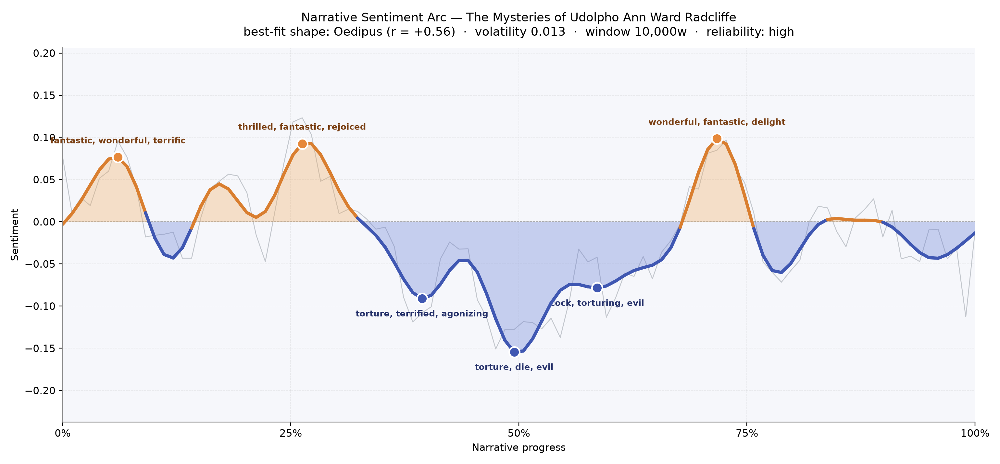
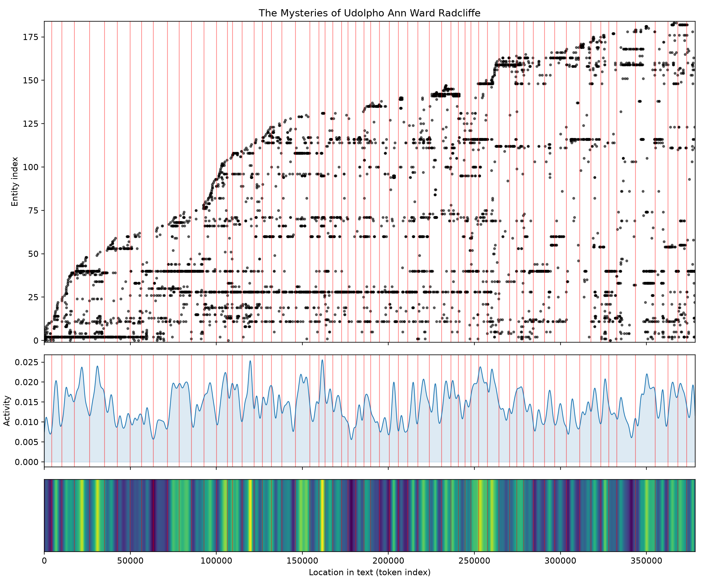
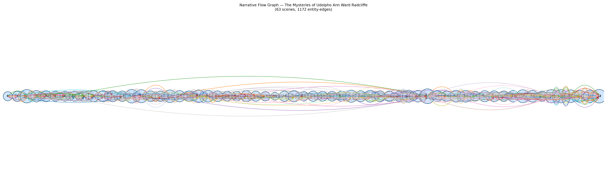

# The Mysteries of Udolpho
### by Ann Ward Radcliffe

293,827 words · an Oedipus arc — a life lifted into light only to be pulled, slowly and deliberately, into the dark.

## The shape of the story

Radcliffe writes a curve that behaves like breath drawn in and never fully released. The opening ascends softly, the reader lulled by a landscape that feels almost pastoral; early on, near the six-percent mark, the prose brightens with "fantastic, wonderful, terrific, rejoiced, delight, succeeded," as if the Pyrenees themselves were rehearsing a promise. A second summit around the quarter mark carries an even warmer flush — "thrilled, fantastic, rejoiced, win, pleasant, beauty" — and one imagines Emily still tethered to a father, a home, a suitor whose name has not yet become a wound.

Then the ground slides. The first descent, near the two-fifths mark, is bruised with "torture, terrified, agonizing, terror, cruel, destroy," and the deeper valley at the exact middle of the book — the true bottom, the castle's black heart — thickens with "torture, die, evil, dreadful, horrible, desperate." A third dip near the three-fifths point still shudders with "torturing, evil, terrible, mad, uproar" before a late, aching recovery around seventy percent brings back "wonderful, fantastic, delight, beauty, won, great." The recovery is real but it is chastened; the arc does not close where it began. This is the Oedipus shape in its truest emotional sense — a fortune raised so that its falling may cost more, a happiness that only half returns because the middle of the book has taught the reader that safety is a costume.

<figure><figcaption>A slow ascent, a long submerged middle at Udolpho, and a bruised climb back into daylight.</figcaption></figure>

## Who lives on the page

Montoni looms over the tally — six hundred and fifty-eight mentions, more than any other name — and that dominance is the novel's argument in miniature: the villain is the weather system under which everyone else must learn to breathe. Valancourt follows close behind, the tender counterweight, the memory Emily carries like a folded letter. Then St. Aubert, whose early death shadows every later scene; Ludovico, the steadfast servant; and Emily herself, quieter in the count than one might expect, as though Radcliffe were letting her heroine be defined by what surrounds her rather than by how often her name is spoken.

Around them cluster Blanche, Annette with her chattering fears, the good Dorothée, Count Morano, and Monsieur Du Pont. A few labels belong to places rather than people — Venice, La Vallée — and a handful ("ma'amselle," "signor") are honorifics the tally has mistaken for names; take them as atmosphere rather than as characters. The mixture is exactly right for a Gothic of manners: a small human family orbiting a single dark planet.

<figure><figcaption>Names accumulate steadily, with clear horizontal bands where a few figures recur across the whole novel.</figcaption></figure>

## The weave of scenes

Sixty-three scenes are strung along the spine like beads on a rosary, and the flow graph shows a texture that thickens rather than thins as the story advances. The early scenes carry modest populations — a dozen or so presences apiece — while the middle swells into denser company (a single scene near the two-thirds mark counts forty-three), and the closing chapters remain crowded, thirty-plus figures moving through each. The long, thin arcs that leap across the whole diagram are the recurring ghosts of the book: Valancourt remembered from a French valley, Montoni echoing long after Udolpho has emptied. Radcliffe braids memory into plot; nothing that enters her story ever quite leaves it.

<figure><figcaption>A rosary of scenes, densest where the castle and its aftermath press hardest on the cast.</figcaption></figure>

## What a reader takes away

You close Udolpho carrying an unease that no marriage at the end can quite dissolve. Radcliffe has taught you how patiently dread can be laid down — mountain by mountain, corridor by corridor — and how much of it survives the return to daylight. Emily walks free, but the reader learns that some rooms, once entered, are never fully left behind.
