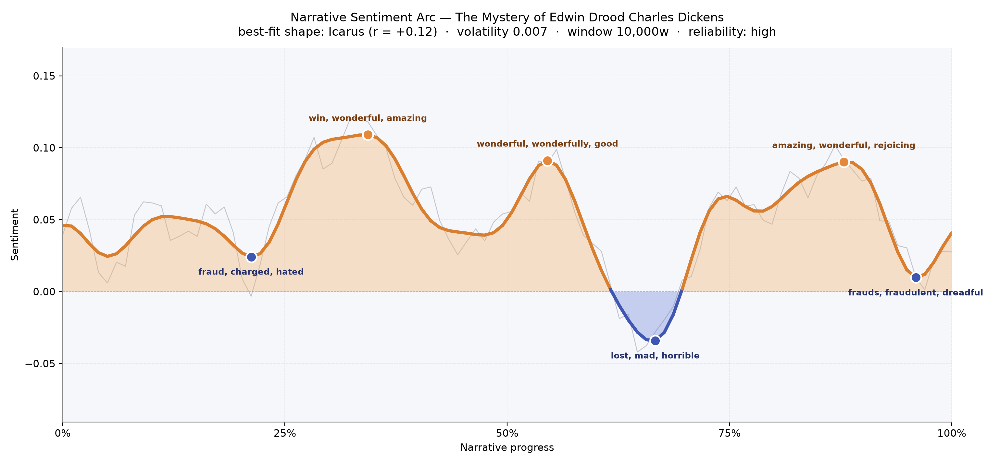
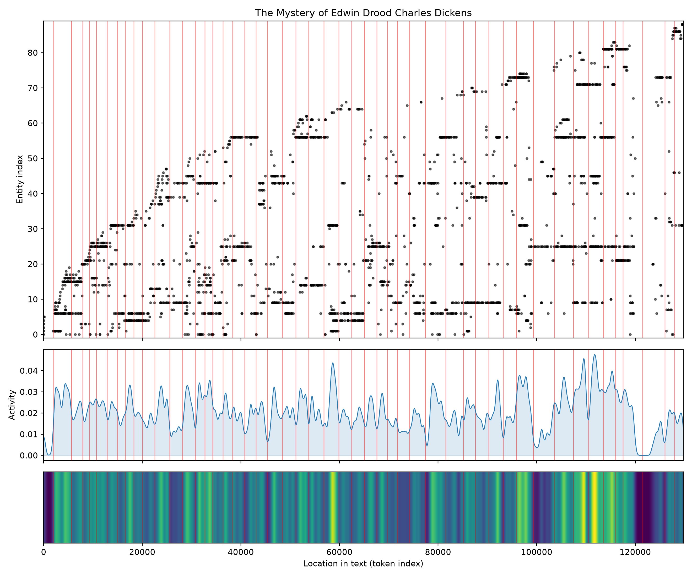
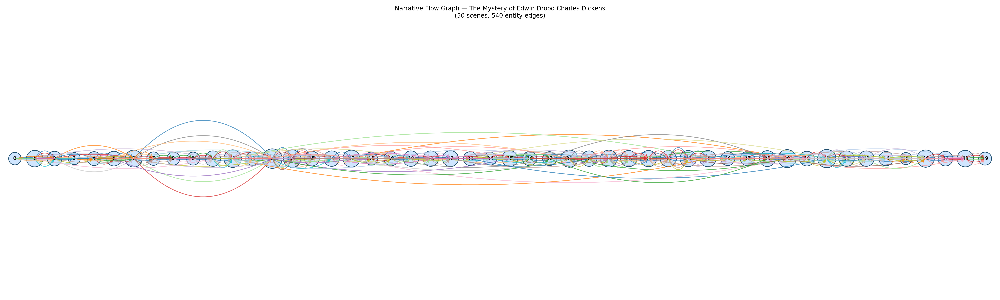

# The Mystery of Edwin Drood
### by Charles Dickens

~98,000 words · an Icarus arc — a story that climbs into sunlight, then singes at the seams before the wax gives way.

## The shape of the story

Dickens's unfinished last novel reads like a candle carried through a cathedral: the light lifts, wavers, and just when it seems steadiest, a draft catches it. Early on, the pages brighten with "win, wonderful, amazing, fabulous, good, happiness" as Cloisterham gathers its cast around choir stalls, gardens, and dinner tables. But before that first summit, a shadow slips in near the one-fifth mark — the first valley bruises with "fraud, charged, hated, loathing, obnoxious, died", the earliest tremor of the accusation and animus that will curdle the plot.

The middle climbs again into "wonderful, wonderfully, good, great, best, impressive" — the deceptive plateau where friendship and courtship look salvageable — and then drops into the book's true trough, thick with "lost, mad, horrible, dreadful, terrible, destructive". That is the emotional pit around Edwin's vanishing, the moment Jasper's mask slips and Cloisterham's certainties dissolve. A last surge follows, buoyed by "amazing, wonderful, rejoicing, great, fascination, good" as Datchery begins his sly reconnoitre, but the closing pages settle back into unease with "frauds, fraudulent, dreadful, dead, hate, worse". Because Dickens died mid-sentence, the arc never resolves — it hovers, mid-fall, exactly where an Icarus story would want its wings to fail. The reliability here is high and the volatility low, which means the rises and drops are genuinely felt, not statistical shimmer.

<figure><figcaption>A luminous climb, a mid-book plunge, and a final surge that never quite lands — the wax softening in real time.</figcaption></figure>

## Who lives on the page

The book's crowded stage belongs, first and improbably, to Rosa Bud, whose name appears more often than anyone else's — an unusual thing in a Dickens novel, where the title character usually looms largest. Instead, Edwin himself trails the pack, a young man whose absence is the whole engine of the story. Around Rosa cluster the four true poles of the novel: John Jasper, the choirmaster with the opium habit; Reverend Crisparkle, the muscular, decent conscience of Cloisterham; and Mr Grewgious, Rosa's stiff-hearted guardian whose loyalty is the book's quiet moral spine. Neville Landless and his sister Helena follow, along with the pompous Mr Sapsea, Miss Twinkleton of the boarding school, and the stonemason Durdles who knows every crypt in town.

A few labels in the list are the tagger's small mistakes rather than characters — "Neville" is filed as a place, "Cloisterham" (the town itself) is filed as a person, and "Datchery" and "Dean" drift between categories. Read them all as figures and settings in one bright bundle: Cloisterham is really the ninth main character, a walled cathedral town whose gossip and gaslight press in on everyone.

<figure><figcaption>Rosa, Jasper, Crisparkle and Grewgious braid tightly through the first half; new presences keep arriving right up to the truncated end.</figcaption></figure>

## The weave of scenes

Fifty scenes, five hundred and forty connective threads — for an unfinished book, that is an astonishingly dense loom. The narrative flow shows almost no thin edges: Dickens introduces his players early and keeps returning to them, so the arcs above and below the timeline swell into full, generous curves rather than skinny hops. There is a visible thickening around the middle chapters, where Jasper's nocturnal expedition with Durdles, the quarrel between Neville and Edwin, and Rosa's terrified interview all stack their casts on top of one another — the busiest scene alone gathers twenty-five distinct presences. The right-hand side, where Datchery arrives and begins to sniff out the truth, stays braided too, weaving new faces into the old chorus. What the picture cannot show is the tear at the end: the loom simply stops, mid-pattern, and the reader is left holding the shuttle.

<figure><figcaption>A tightly-braided score whose final measures were never written — the arcs keep reaching for a resolution that never comes.</figcaption></figure>

## What a reader takes away

*Edwin Drood* leaves you with the strange, tender ache of a song cut off mid-phrase. Dickens has built his machine of suspicion — the opium den, the cathedral crypt, the ring in Grewgious's pocket — and then stepped away forever. What lingers is not the mystery of who killed Edwin, but the fuller mystery of a novelist at the height of his craft still reaching, still braiding new voices in, when the pen fell. It is Icarus not as tragedy but as invitation: the wax is warm, the sun is bright, and the reader is asked, gently, to imagine the flight home.
