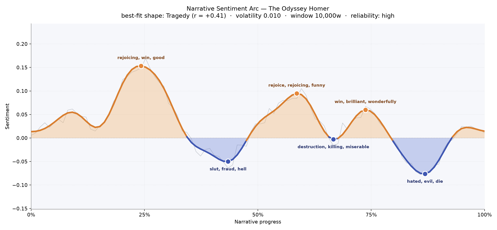
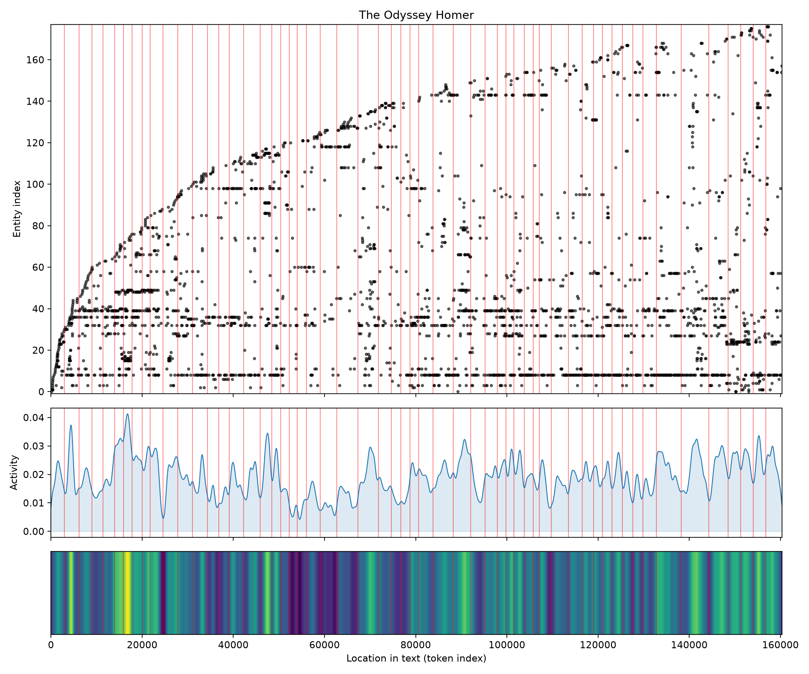
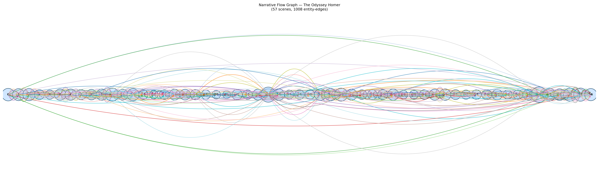

# The Odyssey
### by Homer

About 130,000 words · a tragic arc — a homecoming that keeps darkening even as it wins.

## The shape of the story

The Odyssey does not feel like a triumph if you follow the temperature of its language. Early on, the poem climbs into a sunlit ridge near the quarter mark, glowing with "rejoicing, win, good, best, great, love" — Telemachus finding his courage, Menelaus receiving guests, the Phaeacians dazzled by a wandering stranger. The reader is buoyed. But this is not a book that keeps its light. The mood slumps toward the middle, where the trough near the two-fifths mark bruises with "slut, fraud, hell, dead, killed, victims" — the suitors' rot in the household, the memory of drowned crewmen, the moral stink Ulysses walks back into. There is a brief consolation around three-fifths in, warm again with "rejoice, funny, great, wealth", the hearth glimpsed through the disguise — and then the long, deliberate descent. The final valley near the seven-eighths mark is the darkest of all, heavy with "hated, evil, die, angry, uproar, mad", the slaughter in the hall, the hanged handmaids, the reckoning that reads less like victory than like a wound. The poem's warmth is real, but its ending is a kind of grief. Rising and falling, rising and falling — and the last movement is a fall.

<figure><figcaption>Three golden crests and three darker troughs, with the deepest shadow saved for the ending.</figcaption></figure>

## Who lives on the page

Ulysses towers above everyone with more than five hundred namings — the poem simply belongs to him, its gravity his. Around him orbit the two people who anchor his return: Telemachus, the son growing into a man across the first quarter, and Penelope, weaving and unweaving her patience at home. The gods press in almost as loudly as the mortals — Jove presiding, Minerva shadowing Ulysses like a second conscience, Neptune nursing his grudge across the sea. Then the human circle: Eumaeus the loyal swineherd, Menelaus the courteous host, old Euryclea who knows the scar. Places behave like characters too: Troy behind, Ithaca ahead, Pylos on the way, and the Phaeacians and Achaeans as the peoples who frame Greek memory. A couple of the labels have wandered — Penelope tagged as a place, Ulysses filed under an organisation — a small quirk of automated reading, not a slight against the queen or her husband.

<figure><figcaption>A dense population of gods, mortals, and shorelines, thickest where the story pauses to tell its own past.</figcaption></figure>

## The weave of scenes

Fifty-seven scenes, more than a thousand ties between them: this is a poem that remembers itself. The flow diagram shows a long, evenly beaded spine with arcs vaulting across huge stretches of narrative — figures who appear in Book One reappear near the end, names introduced at Menelaus's table return in the hall at Ithaca. Two swells stand out. A busy hump near the early middle marks the great flashback in the Phaeacian court, where Ulysses narrates the Cyclops, Circe, the underworld, the Sirens — a scene stuffed with the largest cast in the book. The other swell comes right at the close, where a second dense cluster gathers every surviving name for the slaughter of the suitors and the tentative peace after. Between them the strands braid tightly and rarely fray; the poem's architecture is one of long-range echo, not local incident.

<figure><figcaption>A long spine of scenes with wide arcs of memory leaping from beginning to end.</figcaption></figure>

## What a reader takes away

You close The Odyssey and the sea is still in your ears, but so is the blood on the floor of the hall. Homer lets a man come home and refuses to let the homecoming be simple. What lingers is not the cleverness of the disguise or the sweetness of Penelope's recognition, but the price — the drowned companions, the hanged girls, the son who has grown up without a father. It is a book about return that teaches you return is never clean.
