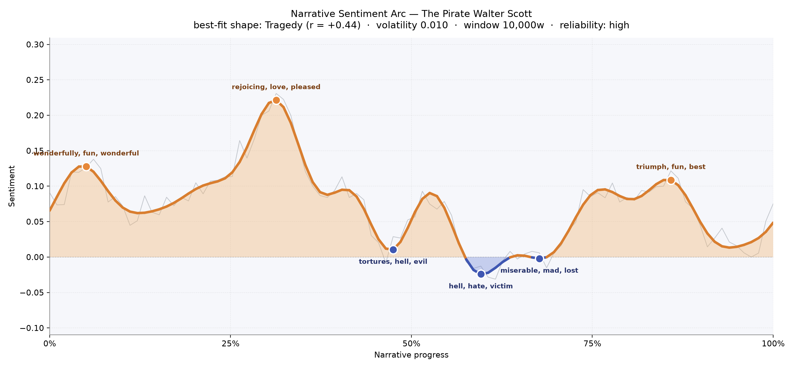
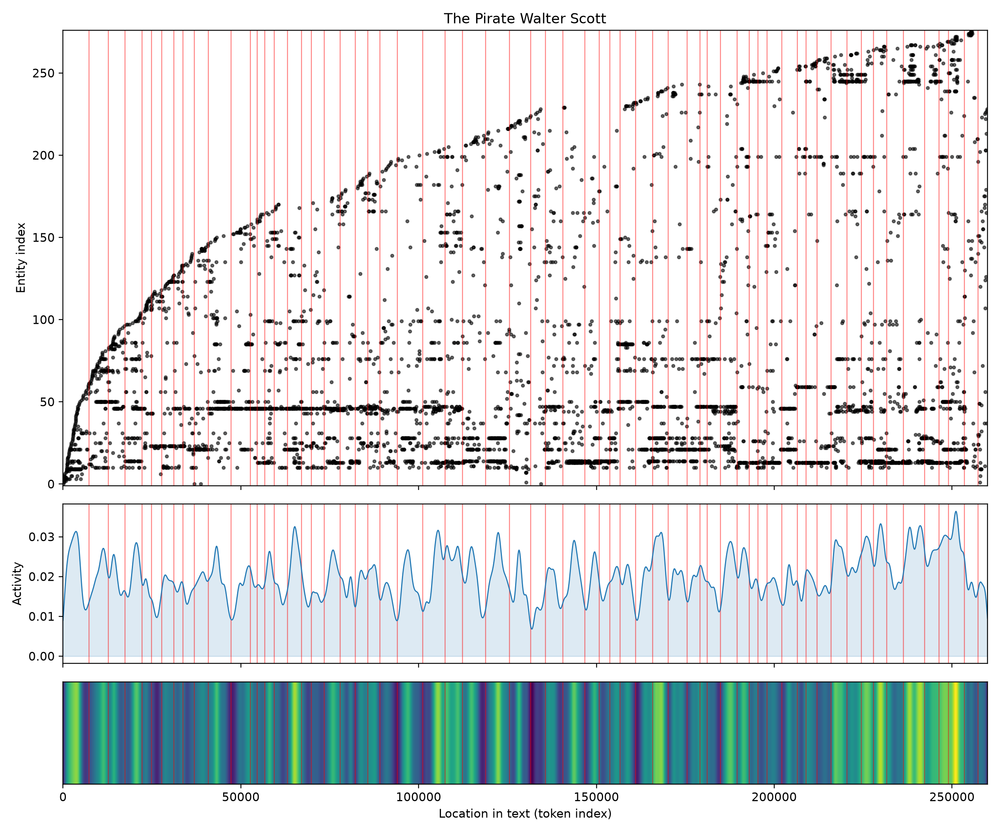

# The Pirate
### by Sir Walter Scott

200,685 words · a Tragedy arc — a bright northern romance that darkens by degrees into hell, hate, and the slow ruin of a man

## The shape of the story

Scott begins in a fair wind. The opening pages of *The Pirate* rise on a light, almost festive current — the early crest of the arc glitters with "wonderfully, fun, wonderful, triumph, won, wealth," the language of a Zetland feast and of young Mordaunt Mertoun welcomed into a great hall. That warmth swells to its brightest around the one-third mark, where the story lifts into its highest peak, a chapter thick with "rejoicing, love, pleased, handsome, best" — a courtship register, the Troil sisters at the center of every eye, the whole islands seemingly conspiring toward affection.

Then the weather turns. Almost exactly at the middle of the book the ground opens: the first valley bruises with "tortures, hell, evil, worse, violent, awful," and a little further on the darkest trough of the whole novel — the true nadir of Cleveland's exposure — lies flat and cold under "hell, hate, victim, betrayed, inexorable, cruelty." A third dip follows with "miserable, mad, lost, dead," Norna's grief and Cleveland's undoing braided together. A modest late peak of "triumph, fun, best, loves, good" tries to lift the story again near the four-fifths mark, but it never regains the altitude of the first act. This is what a Tragedy arc feels like from inside: a long-held summer that will not hold, a hero admired and then hunted, a sea-song that turns into a dirge.

<figure><figcaption>A bright first third, a long dark middle, and a wounded late lift — the classic downward pull of tragedy.</figcaption></figure>

## Who lives on the page

The novel is unmistakably Cleveland's book — the pirate captain's name tops the count by a clear margin, and Mordaunt Mertoun, his rival and shadow, sits just behind. Between them stand the Troil sisters, Minna and Brenda, the two temperaments of the story: Minna's high romantic imagination pulled toward Cleveland, Brenda's sunlit good sense drawn to Mordaunt. Norna of the Fitful Head — the seeress whose prophecies knit the plot — appears almost as often as Brenda, which feels exactly right for a book that lets superstition speak with the same authority as law. Around them cluster the Udaller Magnus Troil (occasionally chopped in the counts into "Magnus" and "Magnus Troil," which are of course one and the same man), the earnest agricultural improver Triptolemus Yellowley, the pirate lieutenant Bunce, the housekeeper Swertha, and the bard Halcro. A few of the top presences are places, not people — Zetland itself and the burgh of Kirkwall — and one or two labels have been misfiled as locations when they are in fact characters, a small quirk to note in passing. Still, the cast reads true to the novel: a small northern world of six or seven pivotal figures, densely observed.

<figure><figcaption>New faces enter steadily throughout, but a handful of names — Cleveland, Mordaunt, Minna, Norna, Brenda — dominate almost every scene.</figcaption></figure>

## The weave of scenes

Sixty-three scenes, more than fifteen hundred connecting threads: the flow diagram of *The Pirate* is a long, packed spine with the same core company recurring almost everywhere. The heaviest knots sit in the opening chapter (an enormous ensemble at Burgh-Westra) and again in the last third, where the plot tightens around Cleveland's capture and the confrontation on Sumburgh Head. Between them the story never really thins; even the quieter middle scenes carry twenty or thirty familiar faces at once, a sign of how firmly Scott keeps the whole community — servants, sisters, suitors, sailors, seeress — inside the same frame. The strands run parallel rather than braided: Mordaunt's line and Cleveland's line move alongside each other, touching Minna and Brenda in turn, with Norna crossing overhead like a gull.

<figure><figcaption>A dense continuous spine of recurring figures, thickest at the opening feast and again at the climactic confrontations.</figcaption></figure>

## What a reader takes away

*The Pirate* leaves the taste of salt and regret. Scott gives you a summer of ballads and courtship and lets you feel, slowly and then all at once, how a single hidden past can pull a whole community's happiness downward. You close the book grateful for Brenda's mild sunshine, uneasy about Minna's grand renunciation, and haunted by Cleveland — a man who was almost, but never quite, allowed to become someone else.
