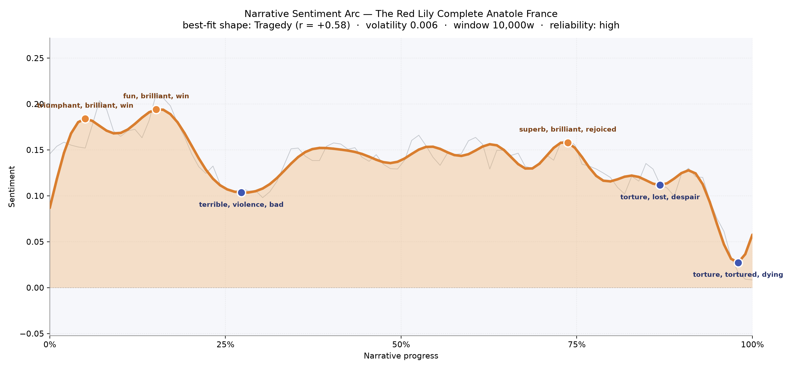
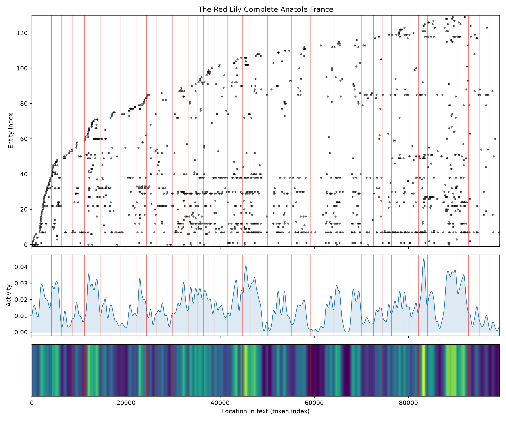

# The Red Lily
### by Anatole France

Roughly 77,000 words · a Tragedy arc — a life that flowers early and slowly darkens toward torment.

## The shape of the story

Anatole France's novel opens in champagne light and closes in ash. The arc climbs almost immediately into a bright morning of Parisian society, where the opening reaches are "triumphant, brilliant, win, fun, pleased" — the vocabulary of a woman moving easily through drawing rooms, admired and undefended. A second, gentler crest around the fifteen-percent mark carries much the same music: "fun, brilliant, win, wonderful, popular, pleasant," as if the story wanted us to be sure of the height before it began the fall.

Then the descent starts. A first bruise appears near the quarter mark, thick with "terrible, violence, bad, crime, dying, selfish" — the reader feels the first cold breath of the jealousy and possessiveness the novel will not release. There is a long, unsteady middle where the arc lifts once more, at roughly three-quarters, on "superb, brilliant, rejoiced, loyalty, victor, great" — the deceptive plateau of a love affair in Florence, where beauty pretends to be enough. But the shape has already decided its ending. The last stretches sink into "torture, lost, despair, terrible, betray, fatality" and finally into a floor of "torture, tortured, dying, selfishness, violent, worst." The reliability of this shape is high, and it feels earned: a novel of manners that quietly discovers it is a novel of ruin.

<figure><figcaption>Two bright mornings, a Florentine afternoon, and a long slow dusk toward torment.</figcaption></figure>

## Who lives on the page

Therese towers over every other presence in the book — her name alone accounts for a hundred and eighty appearances, more than twice any other figure. She is the axis around which the drawing rooms turn. Dechartre, the sculptor-lover, and Le Menil, the earlier attachment she cannot cleanly abandon, weigh heavily too, as do the salon voices of Choulette the ragged poet, Paul Vence the critic, Montessuy her father, and Miss Bell, the English hostess whose villa gathers them all in Tuscany. A few of the labels drift toward noise — "martin" and "jacques" read like fragments of longer names or servants glimpsed in passing, and "napoleon" belongs to the cultivated chatter rather than the plot. The places carry their own weight: Paris where the affair begins, Florence where it flowers, France as the horizon behind everything. The map of names is, in the end, a map of a small, closed society watching one woman try to love honestly inside it.

<figure><figcaption>Therese's constellation — dense at the salon end, thinning as the private grief takes over.</figcaption></figure>

## The weave of scenes

Read as a score, the thirty-eight scenes braid tightly through the middle and fray at the ends. The opening chapter arrives crowded — nearly forty figures at once, a whole Parisian party pressed into the first pages — before the cast narrows to the essential few. Through the long central passage the threads run in parallel, salon and studio and Florentine terrace crossing each other like ribbons. Then, near the climax, one late scene swells suddenly to forty-seven presences: the great confrontation, where every earlier acquaintance seems to press in at once. After that the weave loosens into a thin, exposed tail — six or nine figures in the final scenes, a shrinking world in which Therese is left almost alone with her jealousy.

<figure><figcaption>A crowded beginning, a braided middle, a late crowd-swell, and a bare, quiet ending.</figcaption></figure>

## What a reader takes away

The Red Lily leaves the aftertaste of a beautiful room in which a door has quietly closed. France writes the pleasures of taste and talk with such tenderness that the eventual cruelty of jealousy feels not melodramatic but domestic — the tragedy of a civilised woman who cannot make her heart obey her manners. What lingers is not the ending's torment so much as the memory of how brightly it began, and the recognition, half-rueful and half-French, that this is often how love ends: in the finest company, saying nothing, holding a wilted flower.
