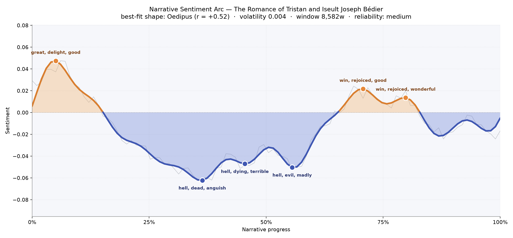
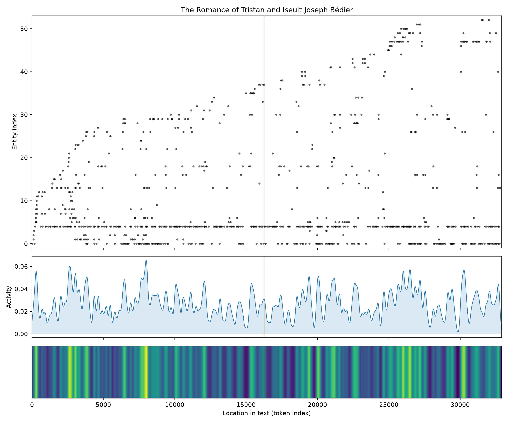
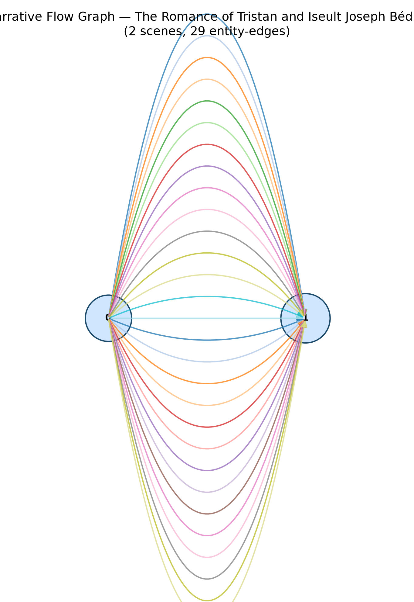

# The Romance of Tristan and Iseult
### by Joseph Bédier

about 26,000 words · an Oedipus arc — a life lifted into rapture only to be dragged down and destroyed

## The shape of the story

Bédier's retelling opens like a bright banner unfurled in a spring wind. The first crest, near the very beginning, hums with "great, delight, good, marvel, love, loves" — a young knight's world where courage is rewarded, potions are drunk in innocence, and the word "love" already threads itself through everything else. Then the ground gives way. From roughly the one-third mark to somewhere past the midpoint, the arc slides into a long, dark trough and stays there. The deepest valley bruises with "hell, dead, anguish, charged, betray, hated"; the next dips into "hell, dying, terrible, hated, hatred, evil"; and the third, near the middle, burns with "hell, evil, madly, vile, mad, die." This is a lover accused, a queen tried, a forest exile, a king's wounded honour — the register of the story darkening in step with the plot. There is a brief recovery in the last third, a modest peak seasoned with "win, rejoiced, good, great, loved, love" and then "win, rejoiced, wonderful, great, splendid, loved," as though the tale remembers its own tenderness one last time before the ending drifts back down under the line. It is the classic downfall shape: the fall is not sudden but slow and inevitable, the way the tide takes a beached ship. This is a book of medium length, so the arc is impressionistic — a mood-drawing rather than a proof — but the mood is unmistakable, and it is grief-shaped.

<figure><figcaption>A bright opening, a long submerged middle heavy with the word "hell," and a brief late gladness before the tide runs out.</figcaption></figure>

## Who lives on the page

Two names tower above everything else: Tristan, named more than three hundred times, and Iseult, named nearly half as often — a proportion that feels right, since he is the one who rides, fights, disguises himself, and travels, while she is the still centre around whom he circles. Around them stand a small, close court: King Mark (and simply "Mark") of Cornwall, the loyal maid Brangien, the Irish champion Morholt, and Kaherdin, brother of the second Iseult in Brittany. Places bleed into people here — Cornwall, Tintagel, Lyonesse, Ireland all appear high in the list, sometimes tagged as if they were characters, which is only fair, since in this romance a kingdom is almost a person and a person almost a landscape. A few softer presences — "queen," "king," "fair," "perinis" — round out the roll. The labels for these figures are a little noisy (Tristan is even tagged as a place), but the cast itself is clean: a lean, medieval ensemble in which every named figure carries weight.

<figure><figcaption>Tristan and Iseult run as unbroken bands along the base; the rest of the court and its kingdoms rise and fall like distant fires around them.</figcaption></figure>

## The weave of scenes

Bédier's book resolves, in this reading, into two great scene-clusters, joined by a dense sheaf of shared figures — twenty-nine threads humming between them. Visually it looks like a mandorla, that almond-shaped halo the medieval illuminators loved: two eyes meeting, the same faces on either side. That is exactly right for a romance of separations and returns. Tristan crosses the sea, comes back, exiles himself, comes back disguised; Iseult waits, dreams, is torn away, is retrieved. The braid is not a long chain of episodes but a repeated crossing, one world to another and back, with the lovers as the shuttle.

<figure><figcaption>Two great scenes clasped by a many-stranded knot — the shape of a story that keeps returning to the same lovers, the same court, the same wound.</figcaption></figure>

## What a reader takes away

What lingers is the sweetness of the opening measured against the long, hell-haunted middle: the sense that love, once drunk, cannot be un-drunk, and that the world will spend the rest of the story punishing the two people who cannot help themselves. Bédier gives us the old story with fresh, clean daylight over it — courteous, grave, unhurried — and its inheritance is a quiet ache. You close the book knowing, as its lovers already knew, that some joys are only borrowed against a debt the heart cannot repay.
