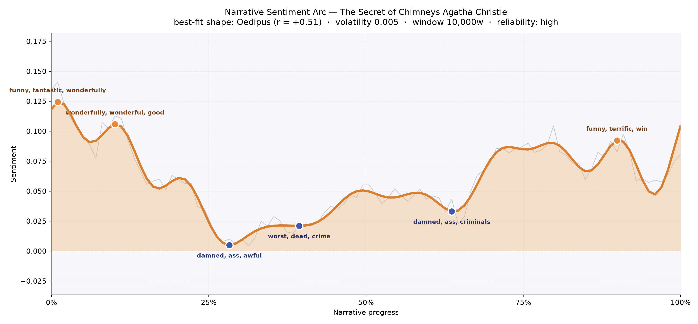
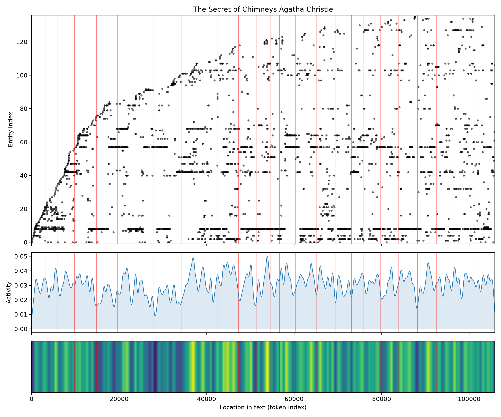
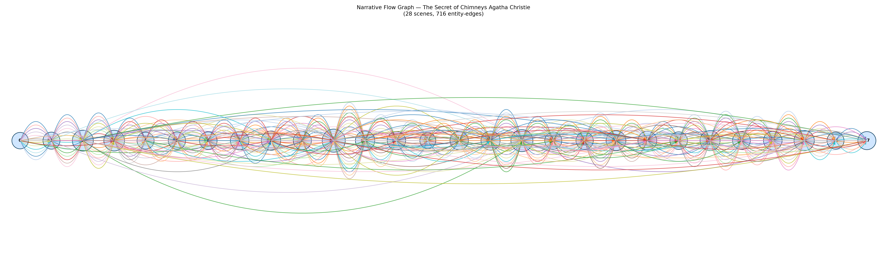

# The Secret of Chimneys
### by Agatha Christie

77,328 words · an Oedipus arc — a story lifted early, dashed in the middle, then patiently rebuilt.

## The shape of the story

Christie opens *The Secret of Chimneys* in a sunlit mood, the kind of easy, drawing-room brightness that promises mischief rather than menace. The opening pages hum with "funny, fantastic, wonderfully, wonderful, soothing, beautiful" — the sound of a hero, Anthony Cade, who has not yet realised his errand will cost anyone their life. A second, gentler crest follows soon after, still trading in "wonderfully, wonderful, good, splendid, magnificent, perfect", the bright chatter of house parties and letters and rumoured Balkan princes.

Then the floor gives way. Around the quarter mark the arc drops into its deepest trough, a passage bruised with "damned, ass, awful, dead, horrible, hysterics" — the discovery that turns a lark into a murder inquiry. The mood does not spring back cleanly; instead it grinds along a second dip near the two-fifths mark thick with "worst, dead, crime, arrested, harassed, crimes", the slow procedural ache of suspicion falling on the wrong shoulders. A third valley, subtler and later, rides on "damned, ass, criminals, betrayed, desperate, violent" — the sting of double-crossing just before the unmasking. Only in the last tenth does the tone lift again, warmed by "funny, terrific, win, fun, wonderful, good", the exhale of a mystery solved and a romance sanctioned. The best-fit shape is an Oedipus curve, and the fit is confident — a life (or rather a fortnight) raised high, thrown down, and then, unlike the myth, mercifully lifted again by Christie's genre instincts.

<figure><figcaption>Two bright ledges of drawing-room banter, a bruised central valley of murder and suspicion, and a late thaw toward the resolution.</figcaption></figure>

## Who lives on the page

Anthony towers over the cast — some 570 mentions, more than the next two figures combined — which is exactly right for a novel that is really the coming-out party of a charming amateur. Virginia Revel is the second presence (the tagger misreads her first name as a place, and lists "Revel" separately as a person; the two are, of course, the same woman). Lord Caterham, the reluctant host of Chimneys, occupies third place, and his daughter Bundle follows close behind — another name the tagger keeps trying to file as a location, a small joke Christie herself might have enjoyed. Superintendent Battle appears both as "battle" and under his full title, splitting his count; taken together he is a heavier presence than the raw ranking suggests. George Lomax, Bill Eversleigh, Hiram Fish the American, the elusive King Victor, and the French detective Lemoine round out the ensemble, with London itself hovering at the edges as the city everyone keeps travelling from. It is a tidy portrait of a country-house mystery: one bright rogue at the centre, a woman his equal in wit beside him, and a ring of officials, aristocrats, and impostors circling the house.

<figure><figcaption>New faces arrive in a steep early rush; once the guests are assembled the cast simply reshuffles across the rooms.</figcaption></figure>

## The weave of scenes

Twenty-eight scenes, and the narrative flow reads like a long braided rope rather than a string of beads. The densest scenes cluster around the middle third — the arrival at Chimneys, the shot in the Council Chamber, the interrogations — with one scene juggling fifty named presences at once. Threads loop generously across the whole span: figures introduced in London reappear at Chimneys, then again at the denouement, and Christie's long arcs of connection (the memoirs, the diamond, the pretender) stitch scene one to scene twenty-eight. The weave thins only slightly at the very start and finish, giving the book the shape of a spindle: gathered at the middle, tapered at the ends.

<figure><figcaption>A spindle of overlapping arcs — every guest at Chimneys is tied back to someone from the first chapter.</figcaption></figure>

## What a reader takes away

*The Secret of Chimneys* leaves behind the particular pleasure of a Christie caper: a hero who treats danger like a good joke, a heroine who refuses to be sheltered, and a house where every corridor hides a letter, a pistol, or a prince. The arc dips hard enough to remind you a man really has died, then rises just enough to send you off smiling — the shape of a summer read that respects its own murder.
