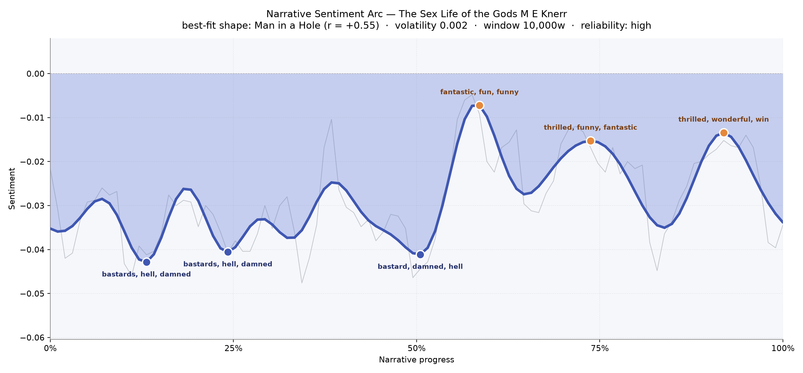
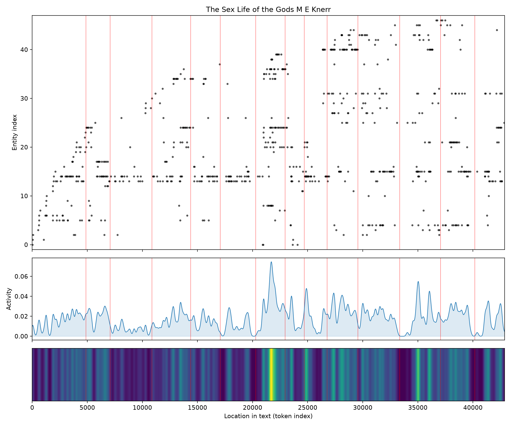
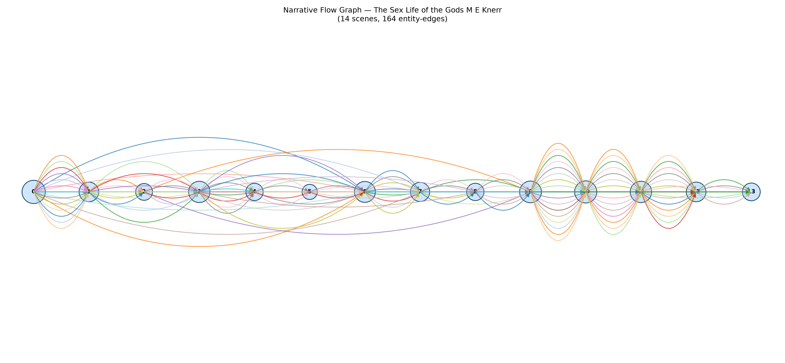

# The Sex Life of the Gods
### by M. E. Knerr

32,265 words · a Man in a Hole arc — a bruised descent into cursing dark, then a slow, grinning climb into wonder

## The shape of the story

Knerr's pulp fable moves like a man walking a long corridor whose floor tips down before it tips back up. The book opens in a low, sour weather — the reader can feel it in the mouth of the prose, where the earliest trough is thick with "bastards, hell, damned, whore, tortured." That register holds for the first half; a second dip near the quarter mark repeats the same bruised vocabulary, and even at the story's midpoint, when a reader might expect some easing, the language sinks again into "bastard, damned, hell, worry, violently." It is a book that keeps its hero — and its reader — in the hole a long time.

Then, right around the fifty-eight percent mark — roughly seventy-two minutes into a steady read — the mood breaks open. The first genuine peak arrives freighted with "fantastic, fun, funny, brilliant, wonderful, beautiful," a giddy tonal shift that reads like the character finally exhaling. A second summit at roughly the three-quarter mark carries "thrilled, funny, fantastic," and the last peak, near ninety percent, is unabashedly triumphant: "thrilled, wonderful, win, terrific, stunning, brilliant." The absolute mood stays faintly overcast throughout — this is not a book that ever quite becomes sweet — but the relative climb is unmistakable. A hole is dug, and then a man climbs out of it taller.

<figure><figcaption>A long half-lit descent gives way to three ascending peaks — the classic Man in a Hole silhouette, walked with a wry grin.</figcaption></figure>

## Who lives on the page

Nick is the sun this small solar system turns around — his name lands one hundred and eleven times, nearly half again as often as anyone else. Around him orbit Beth, the closest and most persistent presence, and Danson, whose surname often couples with Nick's first, suggesting the book's protagonist is really "Nick Danson" split by the counter into two entries. Narvi and Cartwell round out the human core, with Dickson, Andy, and Sam flickering in as recurring satellites.

A few of the labels tagged as organisations — Terran, Brice, Lors, Nolan — read more like faction names or characters mis-sorted; in a science-fiction romp full of invented proper nouns, that kind of slippage is inevitable. Everett and Zark, labelled as places, feel like the story's geography: one earthbound, one plainly off-world. The distribution is refreshingly clean of chapter-heading noise, which lets the cast come through with real shape: a leading man, a woman he cannot shake, a doubled name called Danson, and a small crew of speaking parts.

<figure><figcaption>Nick's line runs low and unbroken across the book; the middle third erupts with new faces as the plot widens.</figcaption></figure>

## The weave of scenes

The narrative flow graph reads like a musical score written for fourteen instruments. The opening scene is a dense chord — twenty-four figures crowding onto the page at once, as if Knerr wants the world established fast and loud. From there the scenes breathe in and out: a lean sixth chapter with only six presences, then a swelling middle where scenes ten and eleven balloon to twenty and twenty-one, the widest movements in the book. That mid-to-late thickening lines up neatly with the sentiment turn — the story gets more populous exactly as it gets more hopeful.

Long looping arcs on the left half show characters introduced early who reappear much later; the tighter, closer braids on the right half suggest a final act where the cast stays put and matters resolve among a familiar circle. It is a shape that mirrors the arc: broad, searching, sometimes bleak in the early stretches, then convergent and warmer at the close.

<figure><figcaption>Fourteen scenes braided by one hundred and sixty-four shared presences — long early loops, tight late crescendos.</figcaption></figure>

## What a reader takes away

*The Sex Life of the Gods* leaves the taste of a rough joke told well — a story that spends a long time swearing at its own predicament before it lets itself laugh. Nick's climb out of the hole is not a redemption so much as a re-tuning: the world was always a little bawdy, a little damned, and by the end that is exactly what makes it wonderful.
