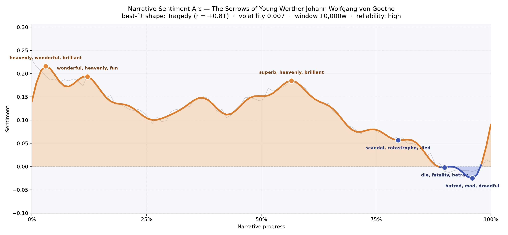
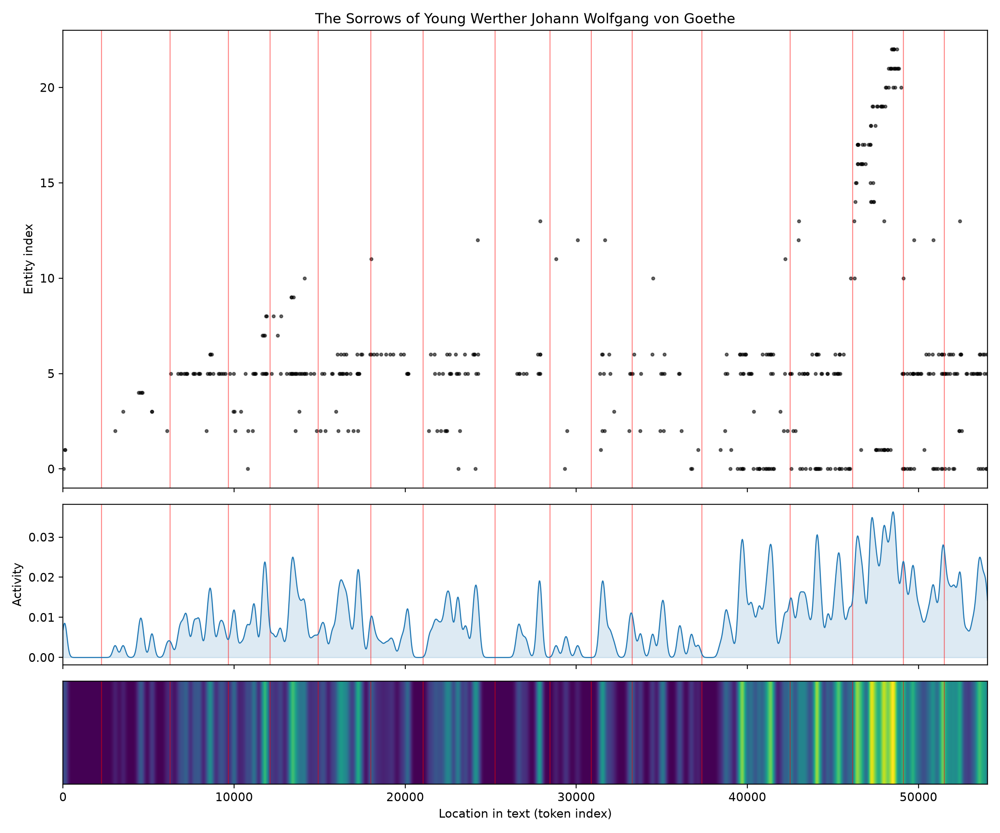
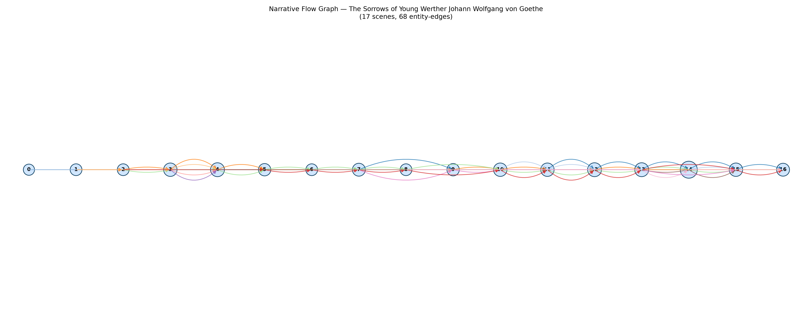

# The Sorrows of Young Werther
### by Johann Wolfgang von Goethe

42,716 words · a Tragedy arc — a heart lit early, then dimmed slowly until it goes out.

## The shape of the story

Goethe's little epistolary storm reads like a candle held too near a window: for most of its length the flame is bright, then something in the air changes, and by the last pages there is only wick and smoke. The arc opens at its highest register — Werther's first letters brim with a young man's giddy self-intoxication, everything at once "heavenly, wonderful, brilliant," a landscape "beloved" and "fun" enough to make him believe he has stumbled into the true weather of the soul. Around the midpoint the mood lifts again, briefly, into a warmer plateau where he can still write of things "superb, heavenly, brilliant" and even "rejoice" — the deceptive second summer of a doomed love.

Then the descent begins, and it is the slow kind, the kind that hurts more than a plunge. By the four-fifths mark the letters have curdled into "scandal, catastrophe, died"; a few pages later they go colder, into "die, fatality, betray, violent, lost, victim"; and the final trough, right before the book closes, bruises with "hatred, mad, dreadful, crime, criminal." It is a very pure Tragedy in the classical sense: no rebound, no consolation, only the long dimming of a bright thing. That the curve is calm rather than jagged — its restlessness is slight — makes it worse, somehow, like watching someone drown in a still pond.

<figure><figcaption>A single long fall: the two early crests of infatuation, the midbook glow of nearness to Charlotte, then the unbroken slope into the closing dark.</figcaption></figure>

## Who lives on the page

Three names carry the book, as one would expect from a novel that is really a triangle. Charlotte tops the count by a wide margin — she is the sun the whole prose orbits, spoken of more often than the narrator speaks his own name. Albert, her steady, decent fiancé, comes next; then Werther himself, whose "I" is so total that his proper name barely needs saying, and Wilhelm, the silent correspondent to whom every letter is addressed, hovering like a confessor at the edge of the room. The tagger misfiles a few of these (Charlotte as a place, for instance, and the archaic address "thou" as somewhere on the map) — a small forgivable stumble on a text this old and this heated.

The tail of the list is its own giveaway: Daura, Colma, Morar, Salgar, Armin, Armar, Ossian. These are not Werther's neighbours but the ghosts he reads aloud to Charlotte from the Ossian poems in the last, terrible scene — the fact that they push their way into the top figures tells you how much the book's final movement is soaked in that borrowed, misty grief. A word like "adieu" gets counted as a person too, which is almost too on-the-nose for a novel of endless farewells.

<figure><figcaption>A quiet, thinly populated first half; then, past the 40,000-word mark, a sudden crowding of names as Ossian's dead flood in and the story's own activity spikes toward the pistol.</figcaption></figure>

## The weave of scenes

Read as a score, the seventeen scene-nodes lie in an almost perfectly linear row — no branching, no parallel plot, no return loop. This is a book that walks in one direction only. The threads between scenes stay sparse and short through the early and middle sections (two, three, four recurring figures at a time — Werther, Charlotte, Albert, Wilhelm, and whichever villager or child he has just fallen in love with that afternoon) and then, near the end, one node blooms with fourteen presences at once: the crowded reading of Ossian, where every mythic name comes rushing in at the exact moment Werther's own world empties. The graph makes visible what the prose keeps whispering — this is a solitary voice that only fills up with company at the moment of collapse.

<figure><figcaption>A straight-line procession of seventeen scenes; the small braid of colour at the far right is where Ossian's ghosts arrive and Werther's letters end.</figcaption></figure>

## What a reader takes away

You close the book carrying the shape of a slow, dignified sinking — a young man convinced that feeling everything at maximum volume is the same as being alive, and a world that quietly, patiently proves him wrong. The Sorrows of Young Werther leaves behind not despair exactly, but the particular ache of watching brightness spend itself.
