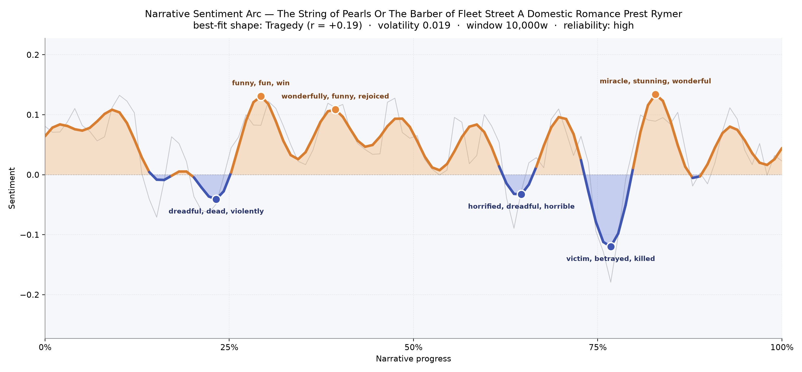
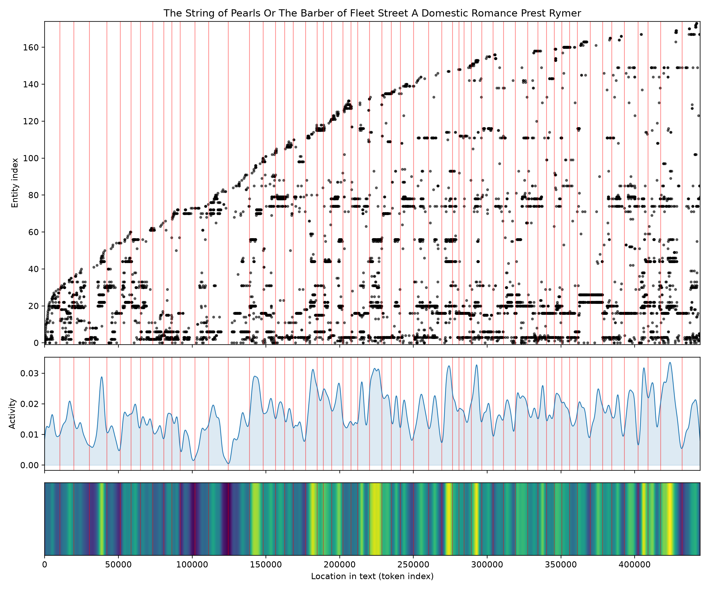

# The String of Pearls, Or The Barber of Fleet Street: A Domestic Romance
### by Thomas Peckett Prest and James Malcolm Rymer

Around 442,700 words that trace a Tragedy — a long London night whose small daylights are only pretexts for the deeper dark to come.

## The shape of the story

Read from end to end, this penny-blood serial breathes like a cellar door that keeps sighing open. The arc lifts and settles, lifts and settles, but every rise proves borrowed. Early on, near the quarter mark, a bright pocket opens where the prose feels almost giddy — the reader coasts through pages coloured by "funny, fun, win, miracle, wonderful, pleasure", and a little later, close to the two-fifths line, a second crest gathers around "wonderfully, funny, rejoiced, happy, good, faithful", as if Fleet Street had briefly forgotten its own reputation. But the book is a Tragedy at heart, and it knows how to snuff a candle. The first shadow, at roughly the twenty-three-percent mark, thickens with "dreadful, dead, violently, horrible, died, idiot". A second dimming near the two-thirds turn broods over "horrified, dreadful, horrible, victim, dead, loathsome". Then, deep into the last quarter, the floor drops out entirely: the deepest trough of the whole novel gathers around "victim, betrayed, killed, dead, bad, loss", the moral bill for every pie eaten in innocence. Even the late spike near four-fifths — glinting with "miracle, stunning, wonderful, wonderfully, beauty" — reads less like recovery than like a lightning flash over a graveyard. The volatility is low, the reliability high; this is not a mood-swinging book so much as a book that keeps its dread on a slow burner, letting steam escape only long enough for us to lean back over the pot.

<figure><figcaption>Three tentative dawns and three deepening dusks — the last valley, near the seventy-seven-percent mark, is where the razor finally shows its full edge.</figcaption></figure>

## Who lives on the page

The census of names is exactly the cast one hopes for. Todd looms largest — the barber himself, whose surname prowls the pages more than seven hundred times — trailed almost immediately by Johanna, the sailor's sweetheart whose search stitches the plot together. Mrs. Lovett, the pie-woman, presides as a kind of grim household deity; the tag "sweeney todd" appears too, doubled as if the villain needed both halves of his name to be believed. Around them cluster Tobias, the terrified boy apprentice, the sailor Ben, and the Oakleys, plus the parallel-story figures Richard Blunt, Arabella Wilmot, and the lovers' friend Mark Ingestrie. A few of the presences — Lupin, Fogg, Ragg, Crotchet — belong to the novel's satellite subplots of madhouses and swindling parsons, and the tool has occasionally mis-labelled Lovett and Todd's shop-name as an organisation, which is fair, since the establishment is very nearly a character. Nothing here reads as noise: this is a large, populous London, and the book knows every one of its inhabitants by candlelight.

<figure><figcaption>Names accumulate like a Fleet Street directory; the lower activity band throbs like footsteps overhead in a shop that keeps far too many customers.</figcaption></figure>

## The weave of scenes

The scene-weave shows a long, evenly braided rope with fifty-seven knots and over a thousand threads between them — exactly the texture of a weekly serial that must recap, cross-cut, and re-introduce. Density is high throughout: many scenes juggle twenty or thirty figures apiece, and the two thickest gatherings sit right at the end, where the final two chapters pull in nearly fifty and thirty-six named presences respectively, a full reunion of accusers, rescuers, and victims. Earlier bulges around the fifteenth and thirty-second scenes correspond to the great crowd-pieces — the madhouse and the vault — where every subplot bumps shoulders in one confined room. What you don't see is a lonely edge or a whisper-quiet centre; the book braids constantly, cross-cutting Johanna's disguise with Tobias's asylum with Todd's shop, so that the reader is never quite allowed to catch breath.

<figure><figcaption>A long horizontal chain of interlocking loops — a serial's memory of itself, tightening into a knot at the finale.</figcaption></figure>

## What a reader takes away

What lingers is the smell of the shop after the shutters go up: a story that flirts with fun and faithful love only to remind us, three times over, that Fleet Street eats its own. You close the book with Johanna safe and Todd condemned, yet the taste is not triumph but a slow, coppery unease — the particular inheritance of a Tragedy told in weekly instalments, where dread was always the sweetest thing on the menu.
