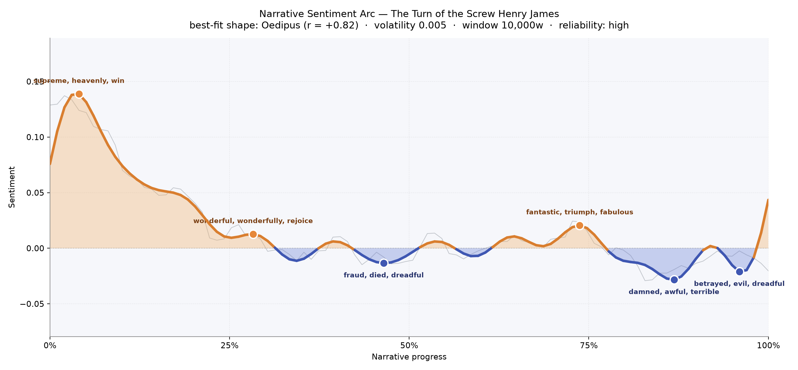
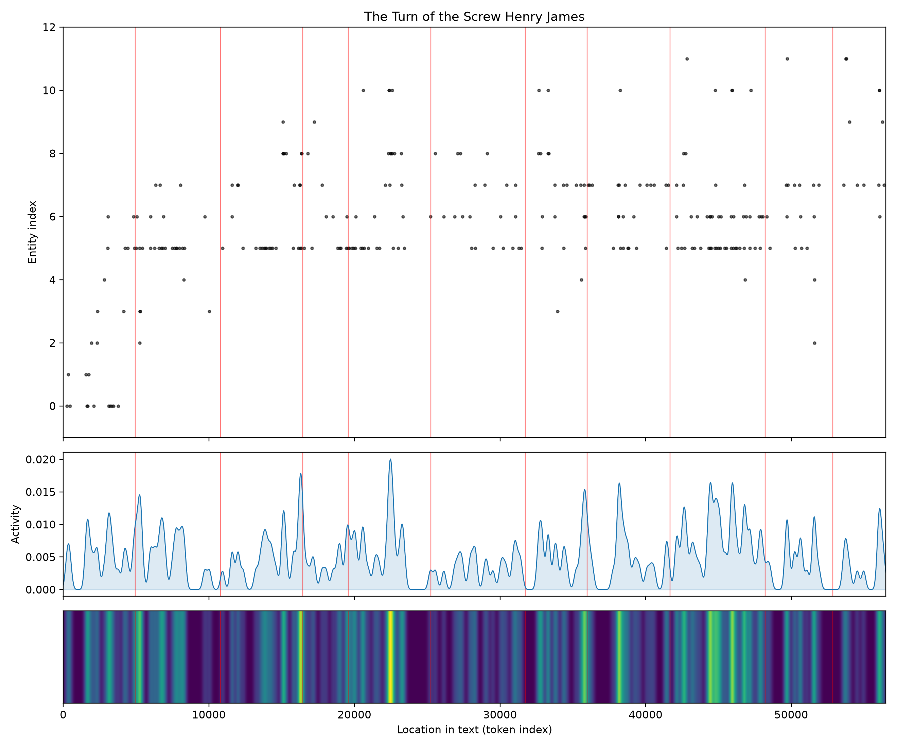
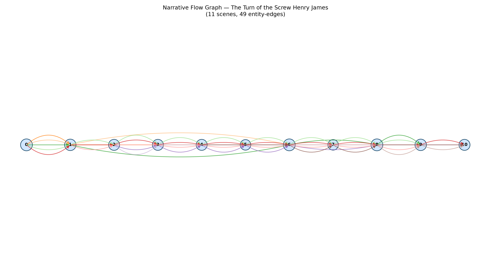

# The Turn of the Screw
### by Henry James

43,448 words · an Oedipus arc — a hopeful ascent that curdles, by degrees, into dread.

## The shape of the story

James begins in a strange radiance. The opening peak glows with "supreme, heavenly, win, wonderful, best, impressed" — the young governess arriving at Bly, half-dazzled by her charges, half-drunk on the romance of being trusted. The arc lifts almost immediately, holds a shorter warm crest around the first quarter where the children still seem "wonderful, wonderfully" good, capable of "rejoice" and "miracle," and then begins its long, patient descent.

Read as a felt experience, the curve behaves like Oedipus: a life lifted only to be undone by the very thing that raised it. Around the midpoint the ground gives way, and the trough near the halfway mark seeps with "fraud, died, dreadful, miserable, despair, worse" — the moment the ghosts stop being rumour and become conviction. A brief false rally near the three-quarter mark shimmers with "fantastic, triumph, fabulous, brilliant" — the governess convincing herself she is winning — before the deepest valley of the book, thick with "damned, awful, terrible, miserable, dumb, bribed." The very last movement, an inch from the end, still bruises with "betrayed, evil, dreadful, worry, worse, ugly." The tiny upward twitch at the close is not relief; it is the flat calm after a small body has stopped moving.

The volatility is low and the reading reliable — meaning the descent is not a jittery mood but a slow-tightening screw.

<figure><figcaption>A bright arrival at Bly, and then the long, patient tightening.</figcaption></figure>

## Who lives on the page

The most-named presence in the book is not the narrator but Mrs. Grose, the housekeeper — a hundred and one mentions, more than Flora and Miles combined. That is telling. James's governess speaks in the first person, so she barely names herself; Grose becomes the mirror she talks into, the plain woman whose belief or disbelief measures every fresh horror. Flora and Miles follow almost in lockstep — the two children the story is fought over — and then the ghosts arrive by name: Quint (with Peter Quint counted separately by the tally) and Jessel, the dead valet and the former governess whose returning faces drive the plot. Douglas, the frame-narrator who reads the manuscript aloud, hovers at the edges. Bly, the house itself, is counted here as a character, which feels right — this is a book where a place presses on people. Harley Street and London are the far-off city of the uncle who refuses to be troubled. A few labels are miscategorised — Bly is a house, Douglas and Griffin are people, not places — but the light misfiling doesn't disturb the picture: a tiny cast, tightly enclosed, watched.

<figure><figcaption>A small cast, densely packed — Grose everywhere, the children woven through, the ghosts arriving in bursts.</figcaption></figure>

## The weave of scenes

Eleven scenes, forty-nine threads between them — a dense, short weave for a short book. The narrative-flow picture reads like a taut cord pulled between two posts: no scene stands isolated, and the same handful of figures reappear across almost every panel. The middle scenes, six and eight, each carry seven named presences — the heaviest braids — the crowded rooms of confrontation, where the governess, Grose, both children and both ghosts are all, in effect, in play at once. The thinner passages at scenes five and seven mark the private interludes, the governess alone with one child or one thought. What the picture makes plain is how claustrophobic the book is by design: the same names keep looping back, the way a small household's footsteps keep crossing the same floorboards.

<figure><figcaption>A tight braid of eleven scenes — the same few figures returning, returning, returning.</figcaption></figure>

## What a reader takes away

You leave The Turn of the Screw the way you leave a room where something has just happened that no one will explain. The arc is the shape of certainty crumbling — of a young woman who arrived believing she could save two beautiful children, and who by the last page holds one of them still in her arms, and doesn't know what she has done. James lets the sentiment sink in slow, weighted steps, and the last word you carry out with you is not a word at all but a quiet, unanswered stop.
