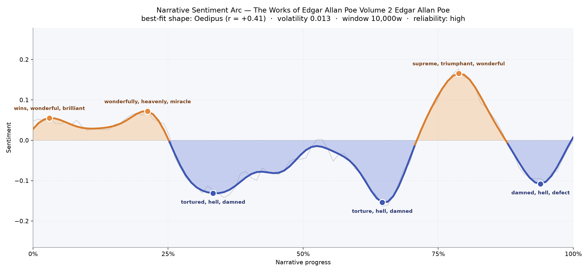
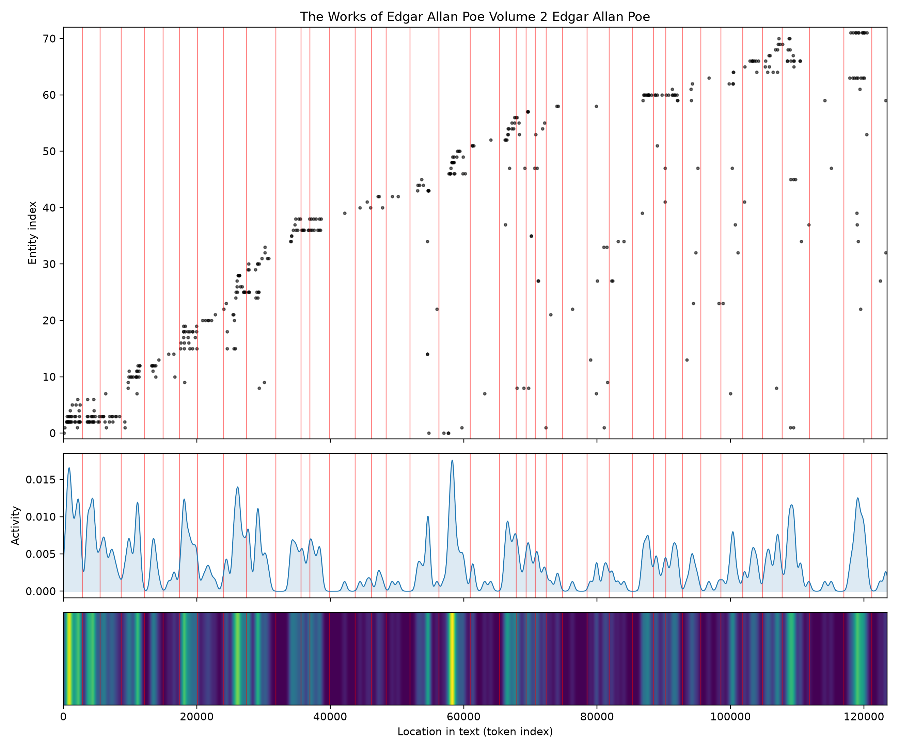
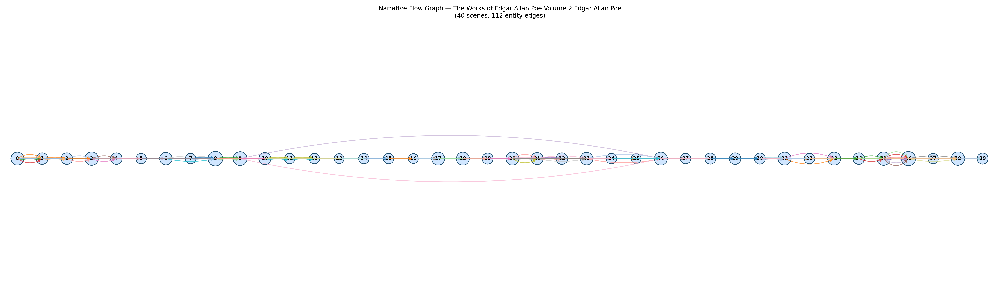

# The Works of Edgar Allan Poe, Volume 2
### by Edgar Allan Poe

roughly 97,000 words · an Oedipus arc — a life lifted only to be undone, three times over

## The shape of the story

This is a volume of tales rather than a single novel, but read end to end it moves like one long, restless nerve. The arc opens in a small, bright uplift — early paragraphs glitter with "wins, wonderful, brilliant, good, great, perfectly," the sort of parlour-room brightness Poe uses to lull you before turning the key in the lock. A second, slightly higher crest arrives around the one-fifth mark, thick with "wonderfully, heavenly, miracle, magnificent," as if a narrator were promising you a marvel. And then the floor gives way.

The first plunge, near a third of the way in, bruises with "tortured, hell, damned, torture, dead, madness" — Poe's characteristic descent into the cellar of the mind. The mood staggers back up, then falls further at roughly the two-thirds point, where the trough deepens with "torture, hell, damned, terrible, deadly, mad." Astonishingly, the highest peak of the whole book comes just after this darkest valley: a surge of "supreme, triumphant, wonderful, rejoice, miracle, fantastic," near the three-quarter mark. It reads like a delirium of victory — the sort of feverish exaltation Poe hands his narrators just before pulling the rug out again. Sure enough, the last stretch slides back down into "damned, hell, defect, harassed, disgusting, hated," closing on a note of ruin. Rise, fall, rise higher, fall again: the felt experience is of a mind climbing toward brilliance and being punished for it.

<figure><figcaption>Two small dawns, two deep cellars, and one feverish summit before the final ruin.</figcaption></figure>

## Who lives on the page

Because this is a collection, the recurring names are actually the recurring narrators and puzzle-pieces of Poe's tales. Dupin, his ratiocinating Parisian detective, dominates — his name appears more than any other, threading through "The Purloined Letter" and "The Mystery of Marie Rogêt," shadowed by the Prefect, his baffled foil. Ellison arrives with his landscape-garden reveries; Wilson doubles himself in the famous story of the guilty twin; M. Valdemar is mesmerised on his deathbed; Von Kempelen turns lead into something more troubling than gold; Scheherazade returns for a thousand-and-second night. Eleonora and Sinbad drift through as story-titles, and Paris, Lofoden, and the Norwegian Moskoe whirlpool give Poe his stages. A few labels — "valley," "Italian," "valdemar" as a place rather than a person — are the tagger's best guesses at proper names inside his baroque sentences, and they should be read as textures more than characters. What emerges is not one hero but a rotating cast of obsessives, each one convinced of his own reason right up to the moment reason fails him.

<figure><figcaption>Names arrive in tight, story-shaped clusters — new cast for each tale, rarely returning.</figcaption></figure>

## The weave of scenes

Read the flow diagram as a musical score and you can hear the volume's structure. Forty scenes strung nearly in a line, with almost every thread arcing only to its immediate neighbour: this is the signature of a story collection, each tale sealed inside its own bubble, characters rarely crossing the border into the next. But two long, graceful loops leap across the middle of the book — the Dupin stories reaching between the mystery of the purloined letter and the whirlpool investigations — binding the centre of the volume together the way a recurring detective binds a career. The density thickens around scenes eight, nine, and again in the mid-thirties, where casts swell to ten or eleven presences; the thinner passages between are the quiet, single-voiced confessions Poe does so well — a man alone in a room, telling you something he shouldn't.

<figure><figcaption>A line of sealed tales, stitched at the centre by the long arcs of Dupin's return.</figcaption></figure>

## What a reader takes away

You close this book slightly out of breath, as though you have been holding a candle down forty separate staircases. Poe's gift, laid bare by the arc, is the way he tempts the mind upward — toward brilliance, toward mastery, toward the "supreme" and "triumphant" — only to show you, with quiet cruelty, that the higher the climb the further the fall. The inheritance is a shiver, and the shiver is thoughtful: reason, in Poe, is never quite safe from what it uncovers.
