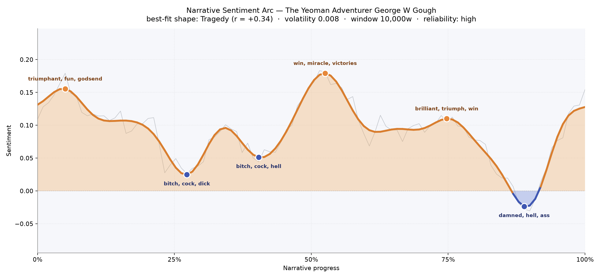
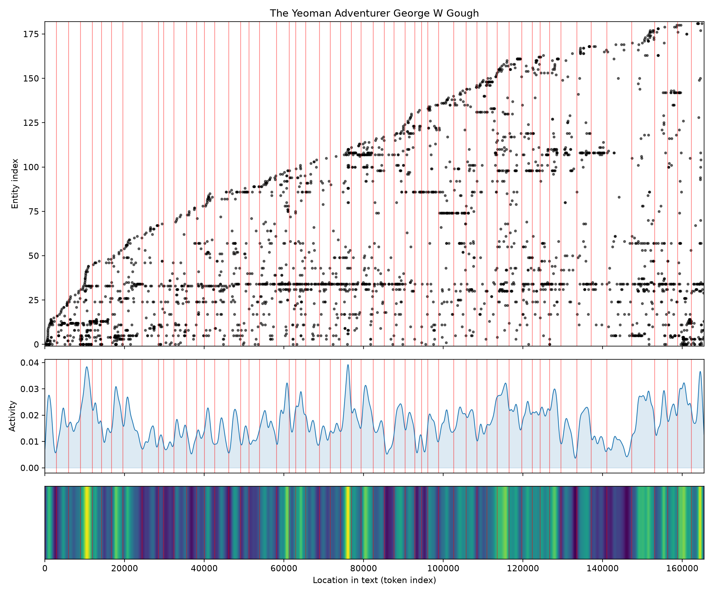
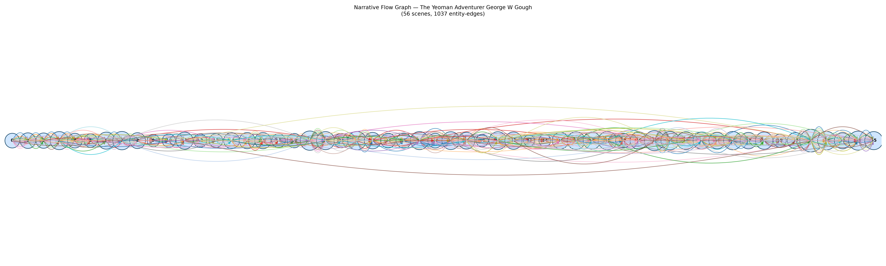

# The Yeoman Adventurer
### by George W. Gough

A brisk 126,545-word Jacobite romance shaped like a tragedy — a life that climbs into daylight only to be dragged, at the close, down into the dark.

## The shape of the story

Gough opens the book on a note of sunlit self-possession. The very first swell rises out of a soldier's cheer, thick with "triumphant, fun, godsend, good, happy, luck" — the yeoman Oliver Wheatman still whistling his own way through Staffordshire, sure the world will bend obligingly around a strong arm and a clean conscience. That confidence is the arc's opening promise, and the reader believes it.

Then the country darkens. Around a quarter of the way in, the mood buckles into its first real trough, a stretch soured by "bitch, cock, dick, damned, lost, dead" — the language of tavern brawls, betrayals, a rider unhorsed, a comrade laid out cold. A second dip near the two-fifths mark is bruised in the same idiom, "bitch, cock, hell, damned, hell's, nasty", as if the road itself had turned foul.

The story then arches into its most radiant crest at the midpoint, gleaming with "win, miracle, victories, great, affection, best" — the great central rally, love confessed and the Cause briefly, gloriously in the ascendant. A third, softer peak follows around the three-quarter mark, glinting with "brilliant, triumph, win, winning, good, merry", a last flourish before the cold. Because this is a tragedy in shape, the final descent near the ninetieth percentile bites hardest: "damned, hell, ass, dead, desperately, jerk". The book ends not on the ballad-note of adventure but on a hush — the ride done, and much of what mattered lost along the way.

<figure><figcaption>A yeoman's arc: three cheerful crests along the road, then a final drop into shadow.</figcaption></figure>

## Who lives on the page

The book belongs, more than anything, to Margaret Waynflete — she looms above every other name in the register, appearing over three hundred times, and the shadow-form "mistress waynflete" trails her closely. Around her orbit the men of the ride: the villainous Colonel Brocton, the narrator Oliver Wheatman himself (who appears both as "oliver" and by his surname), and the loyal, plainspoken Jack. Kate is there as the softer feminine counterweight, Jane too, and the gruff Highlander Maclachlan; Donald and Freake round out the fellowship of the road.

Places carry almost as much weight as people. London hangs at the horizon of the whole march; the Hanyards, the Wheatman family seat, is the hearth the story keeps circling back to; and — charmingly — the great horse Sultan is tagged among the presences, as he should be, since he is very nearly a character in his own right. A stray "i." near the bottom of the list is only a chapter-heading ghost, easy to wave past.

<figure><figcaption>Margaret and Oliver as the two steady horizontal bands; new faces arrive in waves as the ride widens.</figcaption></figure>

## The weave of scenes

Fifty-six scenes, densely interlinked — this is a crowded ride. The narrative-flow picture reads like a long, tapering coach-road: the ends are slender, populated by a small opening cast at the Hanyards and, at the close, by the survivors returning home, while the middle bulges with the crowded inns, camps and skirmishes of the Jacobite march south. Scene 52, near the four-fifths mark, is the fattest node on the road — forty-eight distinct presences jostling in a single stretch, almost certainly the great crisis of capture, rescue and reunion. The braid is thickest exactly where the arc's last cheerful peak stands; after that, both people and mood thin out into the final, quieter descent.

<figure><figcaption>A long coach-road of scenes: sparse at the gates, thronged at the midway inns and the late crisis.</figcaption></figure>

## What a reader takes away

You close *The Yeoman Adventurer* the way you close an old letter from a friend who rode further than he meant to. There is warmth here — good horses, better company, a woman worth every bruise — but Gough will not let his yeoman ride home whole. What lingers is the shape of a young man's world enlarging and then, in the same breath, costing him more than he had reckoned. It is the small, private tragedy hidden inside every large, cheerful adventure.
