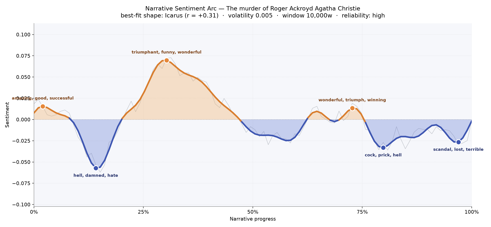
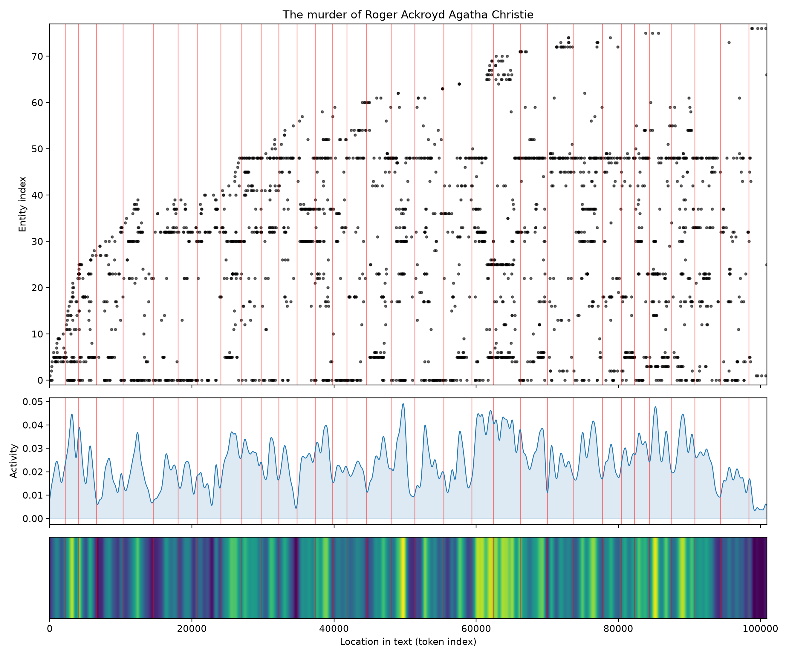
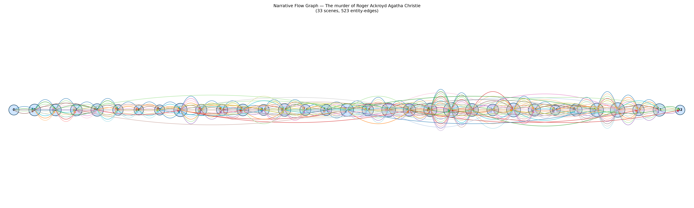

# The Murder of Roger Ackroyd
### by Agatha Christie

72,830 words · an Icarus arc — a bright climb of confidence that softens into a long, careful descent toward a truth no one wanted named.

## The shape of the story

Christie's most notorious mystery reads, at its emotional core, like an Icarus flight: the story lifts on the giddy heat of solving, hovers there in the sun, and then sinks by degrees into cold, undeceived air. The opening pages carry a small early brightness — village life described as "amazing, good, successful, genial, love, beautiful" — the last easy moments before the news of Ackroyd's death breaks the surface. Then, roughly a seventh of the way in, the narrative drops into its sharpest trough, a dark hollow bruised by "hell, damned, hate, hater, arrested, warning." That is the shock of the killing itself and the first suspicions that follow, cast across King's Abbot like a shadow across a lawn.

From there the arc climbs, extravagantly, into its highest peak near the one-third mark, where Poirot's arrival electrifies the story with "triumphant, funny, wonderful, astounded, great, nice." He is the sun the narrative flies toward. A softer second summit near the three-quarter turn — "wonderful, triumph, winning, amazing, great, greatest" — is the false dawn of near-solutions, the moment the reader (and the narrator) most wants to believe the puzzle is done. But Icarus must fall. The late valley near four-fifths in thickens with "hell, killed, kill, greed," and the final dip, almost at the last page, closes on "scandal, lost, terrible, arrested, badly, apathetic" — the exact temperature of a confession written in a quiet room.

<figure><figcaption>A bright ascent to Poirot's triumph, then a slow, deliberate cooling toward the last, unwanted answer.</figcaption></figure>

## Who lives on the page

Poirot presides, of course — 341 mentions, the little Belgian egg-head bending over every dinner-tray and footprint. But the book's genius is that Ackroyd himself, though dead by chapter four, remains second most present: his name (tagged here oddly as an organisation, a small quirk of the reading tools) haunts every scene. Then comes Caroline, the narrator's sharp-tongued sister, whose village gossip is almost a second detective. Flora, Ackroyd's niece, and Major Blunt lend the domestic warmth and awkward tenderness; Ralph Paton and Parker the butler carry the suspicion. Raymond the secretary, Sheppard the doctor-narrator, Miss Russell the housekeeper, Inspector Raglan, and the ghostly Mrs Ferrars round out a household that feels genuinely populated. A stray "ganett" is the neighbour Miss Gannett, slightly misheard by the reading tools — a small English-village accent the machine couldn't quite catch.

<figure><figcaption>New faces stack in early as the household is introduced, then the same familiar names recur, ripening into suspects.</figcaption></figure>

## The weave of scenes

Across thirty-three scenes and more than five hundred connective threads, the flow diagram reads like a long, closely braided rope. The opening chapters are modest in their cast — eleven, seventeen, sixteen figures apiece — the tight parlour of a country doctor's life. Then, around the middle third, the scenes thicken: twenty, twenty-three, twenty-six, thirty-two people crowded into single chapters as the inquest, the interviews, and Poirot's parlour-room reconstructions pull everyone into one frame. The densest scene, with thirty-two presences, is the collective interrogation that folds village and household together. The final scenes taper again — down to nineteen, sixteen, and at last nine — a narrowing spotlight, the room emptying until only two people remain and one truth.

<figure><figcaption>A rope of scenes that swells in the middle around the great gatherings, then draws tight to a single closing conversation.</figcaption></figure>

## What a reader takes away

Christie leaves you with the strange chill of a puzzle whose brightest moment is also its cruellest trap. You climb with Poirot through his little grey triumphs, laugh at Caroline's certainties, warm to a quiet doctor telling a village story — and then the sun goes out. What you inherit from this book is not the solution but the tone of it: a soft, deliberate voice explaining, with terrible courtesy, that the person you trusted was the one you should have watched.
