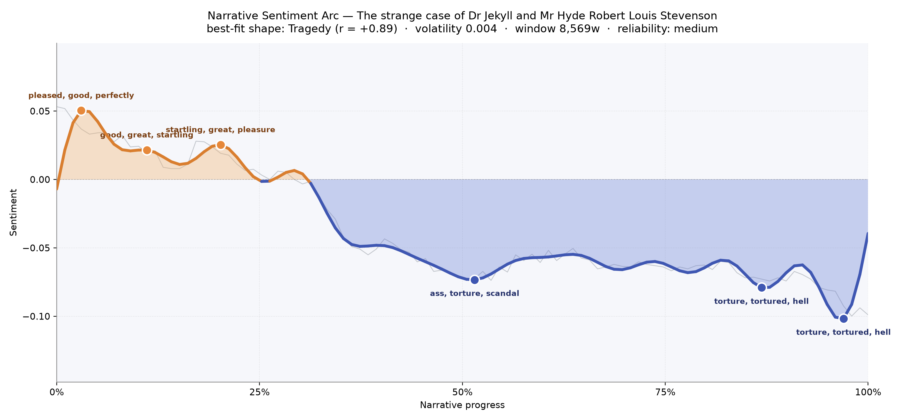
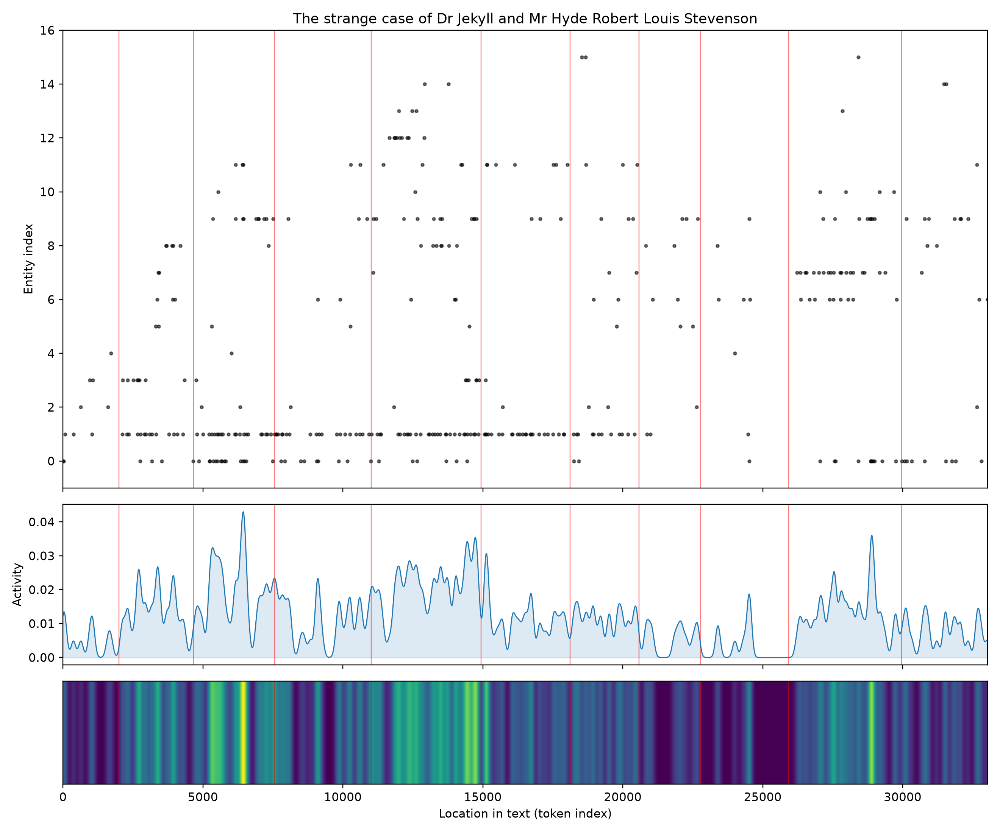
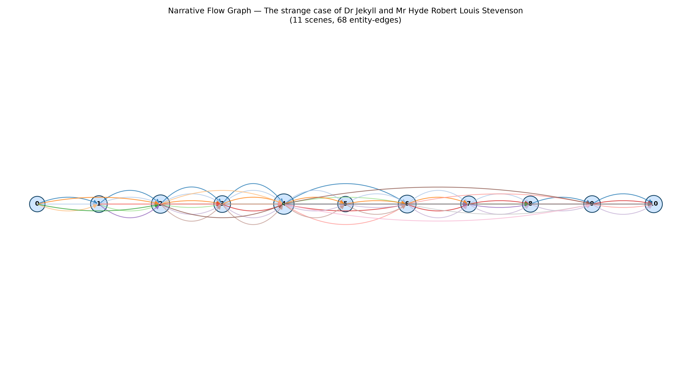

# The Strange Case of Dr Jekyll and Mr Hyde
### by Robert Louis Stevenson

A compact 25,967-word novella that traces a Tragedy arc — a life pitched into a slow, unbroken descent, the mask slipping until nothing is left beneath it.

## The shape of the story

Stevenson's little book falls the way a bell tolls: once, clearly, and then keeps ringing lower. The opening pages sit up in daylight — the first crest is warm with "pleased, good, perfectly, best, celebrated, great," the language of gentlemen at their clubs and the polite respectability of a London solicitor's Sunday walk. A second, quieter peak still hums with "startling, great, pleasure, handsome, wealth," as though the book itself is remembering what Henry Jekyll had before he began to gamble it away. Then, past the quarter mark, the ground gives out. The narrative never really climbs again.

The middle valley near the halfway mark is where the polite world curdles: it turns thick with "torture, scandal, mad, ugly, cruelty," the vocabulary of Carew's murder and the beginning of the town's whispered horror. The final descent — two troughs stacked one behind the other near the eighty-seven and ninety-seven percent marks — reads like the last two confessions of the book: Lanyon's narrative and Jekyll's own full statement. Both are stained with the same handful of words, "torture, tortured, hell, damned, dead, destroyed, despair, damage." You can feel the writer letting the vowels darken. Because the book is short, the arc is impressionistic rather than encyclopaedic, but its direction is unmistakable — the fall is the whole point.

<figure><figcaption>A brief brightness at the doorstep, then a long, deliberate slide into the cellar.</figcaption></figure>

## Who lives on the page

The presence that walks through nearly every scene is not Jekyll and not Hyde but Gabriel John Utterson, the lawyer whose name appears one hundred and twenty-seven times — more than twice as often as either of the men whose secret he is trying to unlock. This is Stevenson's quiet trick: the story of a monster is told through the eyes of the most reasonable man in London, so that the reader learns to distrust reason itself. Hyde and Jekyll follow at fifty-nine and forty-nine mentions, with "Henry Jekyll" and "Edward Hyde" surfacing as their full-dress selves in the later confessions.

Around them stand the small satellite figures the plot needs: Poole the butler, Enfield the distant cousin whose anecdote begins the whole affair, Lanyon the estranged medical friend, and Guest the clerk with the good eye for handwriting. Danvers Carew arrives briefly, only to die. The list also holds two places — London itself, and the specific darker pocket of Soho where Hyde keeps his rooms — and one strange presence, "Satan," which the tool has flagged as a location but which is really a name Jekyll himself reaches for when he tries to describe what he has let loose. It is a telling misreading: the devil, in this book, does have an address.

<figure><figcaption>Utterson threads the low band across every scene; the upper clusters are the confessions catching fire.</figcaption></figure>

## The weave of scenes

The narrative flow lays the book out as eleven beads on a string, and the string is almost perfectly straight — a chain rather than a braid. Stevenson is not writing parallel plots; he is writing a relay race in which each witness hands the baton to the next. The middle scene bulges with fourteen figures, the crowded set-piece where the town, the lawyer, the servants, and the doctor's associates all converge on the closed cabinet door. On either side of that swell the scene populations thin to five or six, the way a mystery narrows as it approaches its answer. The sixty-eight connective strands binding the scenes together are dense but disciplined; the same small cast keeps returning, which is why the horror lands — these are not strangers, they are friends watching a friend disappear.

<figure><figcaption>Eleven scenes strung in a line, swelling at the middle where the household gathers at the locked door.</figcaption></figure>

## What a reader takes away

What stays, after the last page, is not the transformation but the tone of the man watching it happen. Utterson's decency is the book's real tragedy: a good man, calmly and thoroughly, discovers that goodness may only be the smaller of two tenants. Stevenson leaves you with the memory of a door that will not open, a handwriting that betrays itself, and the quiet certainty that the fall was there in the foundations all along.
