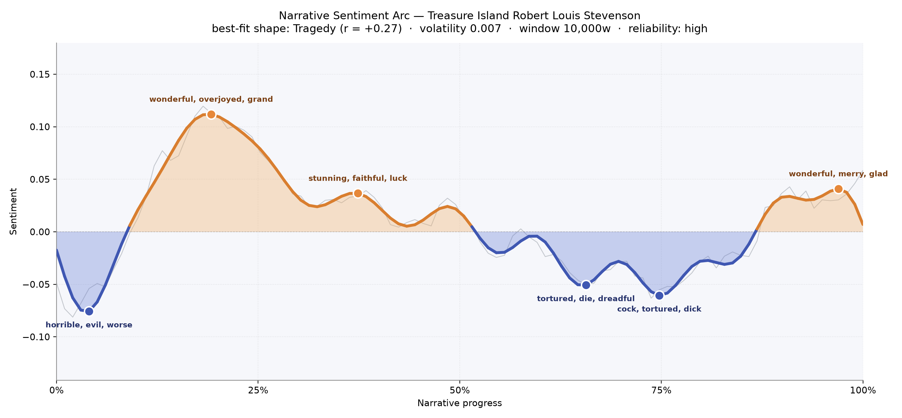
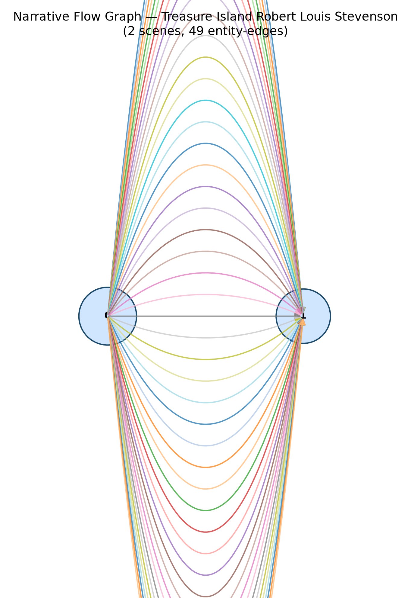

# Treasure Island
### by Robert Louis Stevenson

70,496 words, roughly a four-hour read, tilted toward tragedy — a boy's holiday that keeps sliding into something bloodier and older than he is.

## The shape of the story

Stevenson's arc behaves like a sea it insists on being: the first swell lifts high, the second climbs less far, and the long middle stretch keeps pulling the reader downward into troughs that darken with each visit. Right at the opening bell — a mere thirty minutes in — the mood drops into a valley bruised with "horrible, evil, worse, lost, kill, die," and you can feel the Admiral Benbow inn already smelling of tar and coming death. Then, quickly, near the one-fifth mark, the story lifts into its brightest peak, thick with "wonderful, overjoyed, grand, great, delight, best" — the moment the map is unfolded, the schooner promised, the whole enterprise still a lark in a young boy's head. A second, gentler crest around a third of the way in still glows with "stunning, faithful, luck, great, pleasant, handsome," the last flush of shipboard optimism before things sour.

After that the ledger runs red. Two thirds through, the trough near the stockade is heavy with "tortured, die, dreadful, angry, died, betrayed," and only a little further on, near three-quarters, the mood sinks again into "cock, tortured, dick, violent, die, disgust." Only in the final pages does the arc lift once more, closing on "wonderful, merry, glad, lucky, good, luck" — a homecoming that feels like a survivor's exhale rather than a triumph. The best-fit shape is Tragedy, but Stevenson softens it: the reader is not destroyed, only sobered.

<figure><figcaption>An early joy that never quite returns — the arc of a boy who learns what men are.</figcaption></figure>

## Who lives on the page

Jim rides atop the roster, as he should — this is his voice, his ledger, his fear. Close behind him, almost shoulder to shoulder, comes Silver, the one-legged sea cook whose charm outweighs half the honest men in the book. Flint appears high on the list too, though he is really the ghost the plot orbits: a dead captain whose name is a currency more than a character. Doctor Livesey and Captain Smollett anchor the lawful side; Ben Gunn, the marooned goat-eater, gets his own outsized share of mentions, as does the schooner Hispaniola, which the tally treats like a person and which, honestly, behaves like one. Trelawney, Hunter, Joyce, Morgan and Dick fill the muster; "hawkins" and "john" are shadows of Jim and Silver picked up under alternate names. A few labels — Hispaniola as a place, Flint as a geography — are the tally's small confusions, but the cast list is unmistakably Stevenson's.

<figure><figcaption>Names entering the story like sails on a horizon; activity thickens around the mutiny and the island's last night.</figcaption></figure>

## The weave of scenes

The flow graph reduces the book to two great basins with forty-nine threads arcing between them — a fair likeness of a novel that really does live in two places. There is the England of the first act, all inn-parlour and coach-road, and there is the island, where the story spends its blood. Nearly every figure crosses from one basin to the other: the doctor, the squire, the captain, Jim himself, and of course Silver, who slides across that bridge more often than anyone. The picture is symmetrical, almost hourglass-shaped, and it flatters the book's design: Stevenson built a story you can hold in two hands.

<figure><figcaption>Two harbours, one crossing — the shape of a voyage told from both ends.</figcaption></figure>

## What a reader takes away

Treasure Island leaves the taste of salt and gunpowder and a boy's slow, unwelcome education in men. You come for the map and the parrot; you stay because Silver keeps making you like him against your will; you close the book quieter than you opened it, richer by a chest of coin and poorer by a few illusions.
